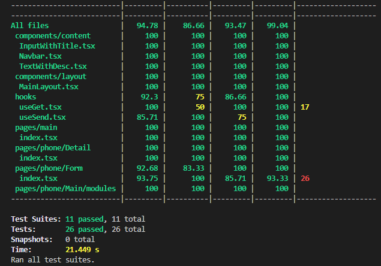

# Phone Catalogue (SRIN Test - Frontend)

## Tech Stacks

- React 19
- TypeScript
- Ant Design
- Jest
- Vite

## How to Setup

- Clone this repo
- Move to this project directory in the terminal
- Install all the packages needed

```
npm install
```

- Run the program locally

```
npm run dev
```

- FE should be running on http://localhost:5173/

## Commands Available

- Run program : `npm run dev`
- Install packages : `npm install`
- Run jest coverages (all) : `npm run cov`
- Run jest coverages (some files/folders) : `npm run cov -- <file/folder>`
- Run jest test : `npm run jest`

## App Directory
- public ------------------------- Public assets
- src/ ---------------------------- Main code
  - \_\_test__/ -------------- Testing folder
  - components/ --------- Custom shared components folder
  - const/ ------------------ Shared constant
  - hooks/ ----------------- Custom hooks
  - pages/ ----------------- Web Pages folder
  - styles/ ------------------ Shared styles
  - App.tsx ---------------- Routing
  - main.tsx --------------- Core React
  - types.ts ---------------- Shared typing


## Unit Testing Result
- Testing includes all components except App.tsx & main.tsx
- Unit Test is excluding all .ts files


